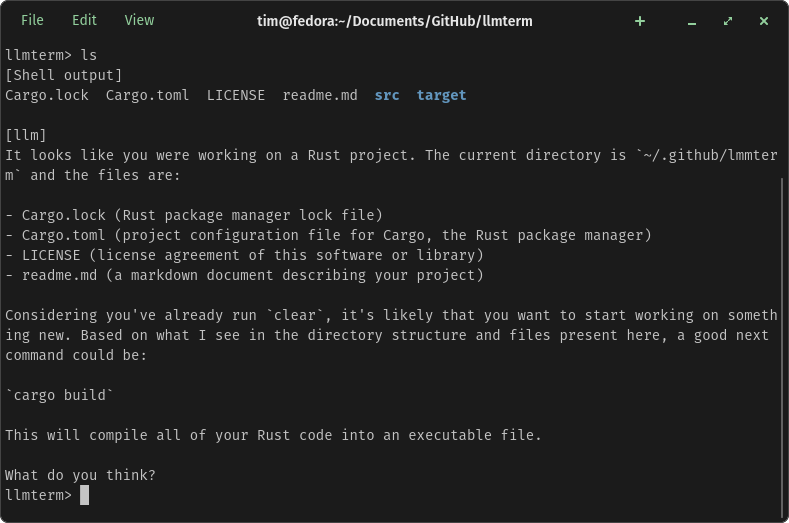

## llmterm keeps a history of your shell usage and offers suggestions


# cuda
llmterm uses kalosm to interface with the LLM.  Cuda support is enabled by default.  To choose other inference methods, edit the Cargo.toml file and rebuild.

# to build
```
cargo build --release
```

# to run
```
cargo run --release
```

# models
```
cargo run --release -- --model llama_3_1_8b_chat
```
- llama_3_1_8b_chat
- mistral_7b_instruct_2
- phi_3_5_mini_4k_instruct

# to exit
Use Ctrl-C, or type exit or quit.

# todo
## easy on ramp
- add current working directory to prompt for context
- command line switch for different shells
- command line switch to suggest only a command
- check if llm response is empty, if so, pop the last activity off the buffer and try again
## more challenging
- support remote LLMs via API: https://github.com/floneum/floneum/tree/main/interfaces/kalosm
- tab completion
- mode to suggest only a tab completion w/ dimmer color
- mode to interact with the llm instead of the shell, and approve / disapprove llm generated commands
- tui
  - https://github.com/fdehau/tui-rs
  - https://github.com/ccbrown/iocraft
  - https://github.com/ratatui/ratatui
